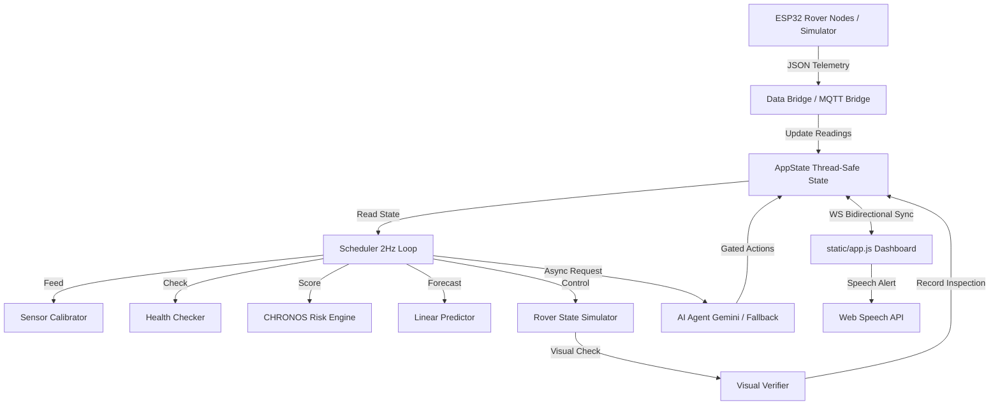

# Sentinel Twin X — Repository Audit Report

This document presents a comprehensive audit of the **Sentinel Twin X** building emergency digital twin and autonomous inspection system. It details the file structures, data flows, hardware integrations, and identifies bugs, duplicate code, performance limits, security issues, and areas of improvement.

---

## 1. Folder Structure

The workspace directory structure is organized as follows:

```
Sentinel Twin/
├── .env.example              # Example environment variables (Gemini/Groq keys, MQTT configuration)
├── .env                      # Real environment variables (containing active credentials)
├── AUDIT.md                  # [THIS FILE] System audit, configuration, and security review
├── DEMO_SCRIPT.md            # Step-by-step 90-second script for SyncHack 2026 judges
├── JUDGE_QA.md               # Cheat sheet for anticipated questions and architectural defenses
├── README.md                 # System overview and quick start guide
├── SENTINEL_TWIN_MASTER_GUIDE.md  # Comprehensive guide for student/operator onboarding
├── START_DEMO.bat            # Windows batch script to launch the simulator mode server
├── START_MQTT.bat            # Windows batch script to launch the hardware MQTT mode server
├── requirements.txt          # Python packages (FastAPI, Uvicorn, Paho-MQTT, Numpy, Dotenv)
├── run.py                    # Unified entry point for starting the backend and UI
├── ai/
│   ├── __init__.py           # Package initializer
│   └── templates.py          # Local offline deterministic narrative report generator
├── config/
│   └── building.json         # Single source of truth for zones, thresholds, and pin maps
├── deploy/
│   └── mosquitto/
│       ├── mosquitto.conf    # Mosquitto broker configuration (listeners, logging, authentication)
│       └── setup_broker.sh   # Linux bash script to install and configure Mosquitto
├── docs/
│   ├── AEGIS_README.md       # Readme for the Aegis v2 codebase history and invariants
│   ├── SETUP_GUIDE.md        # Network setup, Pi configuration, and ESP32 flashing instructions
│   └── wiring.md             # Hardware schematic details, voltage dividers, and strapping pins
├── engine/
│   ├── calibrator.py         # Dynamic statistical baseline learning and threshold adjustment
│   ├── chronos.py            # Rule-based chemical, thermal, and obstruction scoring engine
│   ├── config_loader.py      # Module to load building.json configurations into memory
│   ├── predictor.py          # Linear regression trend forecaster (30-second lookahead)
│   ├── recommender.py        # Dijkstra-based safer exit router and voice announcement text generator
│   └── sensor_health.py      # Sensor health validator (checks for stuck, spike, range, flatline)
├── firmware/
│   └── sentinel_esp32/
│       └── sentinel_esp32.ino # C++ code for the ESP32 rover client (sensors, motors, buzzer, MQTT)
├── rover/
│   ├── __init__.py           # Package initializer
│   ├── missions.py           # Priority-queued rover mission manager (patrols, battery, alarms)
│   ├── navigation.py         # Dijkstra path planning and coordinate interpolation on SVG map
│   ├── rover_sim.py          # State machine, travel updates, battery model, and verification triggers
│   └── verifier.py           # Heuristic pixel-analysis simulation (visual confirmation of fire/smoke)
├── server/
│   ├── __init__.py           # Package initializer
│   ├── action_system.py      # Validates, logs, and executes manual or operator-approved actions
│   ├── ai_agent.py           # Orchestrates cloud Gemini LLM content generation and local fallbacks
│   ├── app.py                # FastAPI server, REST API endpoints, and WebSocket dispatcher
│   ├── data_bridge.py        # Core thread feeding sensors to state (Simulator or UART USB Serial)
│   ├── mqtt_bridge.py        # Handles WiFi/MQTT communication from rover nodes
│   ├── scheduler.py          # 2Hz orchestrator ticking calibration, health, risks, and missions
│   └── state.py              # Thread-safe in-memory global state repository (AppState)
├── simulator/
│   ├── __init__.py           # Package initializer
│   └── sensor_sim.py         # Multi-zone environmental simulator with noise injection and scenarios
└── static/
    ├── app.js                # Core frontend dashboard layout controller and voice engine
    ├── index.html            # Main operator command dashboard (SVG map, telemetry tiles)
    ├── map_renderer.js       # Renders layout zones, risk status, and path lines on the SVG floorplan
    ├── rover_panel.js        # Formats rover stats, live diagnostics metrics, and inspection tables
    ├── sensor_cards.js       # Renders telemetry cards with sparklines and offline fallback displays
    ├── style.css             # Dark-themed cyberpunk styling and responsiveness tokens
    └── ws_client.js          # Establishes WebSocket channels and updates the UI
```

---

## 2. File Purpose

### Root Level
*   [run.py](file:///c:/Users/kunal/OneDrive/Desktop/Sentinel%20Twin/run.py): Entry point script that parses arguments, launches the default browser, and spins up Uvicorn to run the FastAPI app.
*   [requirements.txt](file:///c:/Users/kunal/OneDrive/Desktop/Sentinel%20Twin/requirements.txt): Declares required packages such as `fastapi`, `paho-mqtt`, `numpy`, `python-dotenv`, and `pyserial`.
*   [START_DEMO.bat](file:///c:/Users/kunal/OneDrive/Desktop/Sentinel%20Twin/START_DEMO.bat) / [START_MQTT.bat](file:///c:/Users/kunal/OneDrive/Desktop/Sentinel%20Twin/START_MQTT.bat): Executables to instantly spin up the server in simulated or live broker hardware mode on Windows.

### Configuration
*   [config/building.json](file:///c:/Users/kunal/OneDrive/Desktop/Sentinel%20Twin/config/building.json): Central building configuration. Maps 10 zones with positions and neighbors, holds default safety thresholds, and maintains hardware pin definitions.

### Engine Directory
*   [engine/config_loader.py](file:///c:/Users/kunal/OneDrive/Desktop/Sentinel%20Twin/engine/config_loader.py): Parses `building.json` and exports structured configuration shapes (`ZONE_CONFIG`, `ZONE_GRAPH`, `ZONE_MAP_POSITIONS`, etc.) to the other modules.
*   [engine/sensor_health.py](file:///c:/Users/kunal/OneDrive/Desktop/Sentinel%20Twin/engine/sensor_health.py): Analyzes a rolling queue of values to identify stuck parameters, statistical spikes, out-of-range boundaries, and flatlined sensors.
*   [engine/calibrator.py](file:///c:/Users/kunal/OneDrive/Desktop/Sentinel%20Twin/engine/calibrator.py): Computes dynamic temperature, smoke, and humidity thresholds using the standard deviation and mean of the first 20 baseline readings.
*   [engine/chronos.py](file:///c:/Users/kunal/OneDrive/Desktop/Sentinel%20Twin/engine/chronos.py): Calculates the 0–100 risk score based on heat, smoke, and blockage. Incorporates an Exponential Moving Average (EMA) filter ($\alpha=0.35$) to smooth noise and bypasses faulty sensors.
*   [engine/predictor.py](file:///c:/Users/kunal/OneDrive/Desktop/Sentinel%20Twin/engine/predictor.py): Fits a linear regression model over the last 30 readings to estimate if the zone will reach critical status ($Risk \ge 80$) within 30 seconds.
*   [engine/recommender.py](file:///c:/Users/kunal/OneDrive/Desktop/Sentinel%20Twin/engine/recommender.py): Executes Dijkstra's algorithm to determine the safest route to an exit. Weights paths dynamically based on zone risk scores to route occupants away from danger.

### Server Directory
*   [server/state.py](file:///c:/Users/kunal/OneDrive/Desktop/Sentinel%20Twin/server/state.py): Implements the thread-safe `AppState` class, storing zones, risk scores, rover status, audit logs, and layout states.
*   [server/app.py](file:///c:/Users/kunal/OneDrive/Desktop/Sentinel%20Twin/server/app.py): Exposes FastAPI endpoints, handles client WebSockets, and manages app lifecycle startup and shutdown.
*   [server/scheduler.py](file:///c:/Users/kunal/OneDrive/Desktop/Sentinel%20Twin/server/scheduler.py): Runs a background loop that ticks every 2.0 seconds, orchestrating calibration, health checking, CHRONOS scoring, predictions, and rover dispatches.
*   [server/action_system.py](file:///c:/Users/kunal/OneDrive/Desktop/Sentinel%20Twin/server/action_system.py): Handles execution and logging of commands, forwarding buzzer controls, and routing layout updates.
*   [server/ai_agent.py](file:///c:/Users/kunal/OneDrive/Desktop/Sentinel%20Twin/server/ai_agent.py): Performs asynchronous calls to Google Gemini API to analyze building trends, falling back to offline templates if internet or API keys are unavailable.

### AI Directory
*   [ai/templates.py](file:///c:/Users/kunal/OneDrive/Desktop/Sentinel%20Twin/ai/templates.py): Formulates rule-based natural language reports containing specific sensor metrics when offline.

### Rover Directory
*   [rover/navigation.py](file:///c:/Users/kunal/OneDrive/Desktop/Sentinel%20Twin/rover/navigation.py): Executes shortest path Dijkstra routing over the zone coordinates and handles interpolation along straight line segments.
*   [rover/missions.py](file:///c:/Users/kunal/OneDrive/Desktop/Sentinel%20Twin/rover/missions.py): Enforces priority preemption loops (Battery Return [4] > Emergency [3] > Manual Check [2] > Patrol [1]).
*   [rover/rover_sim.py](file:///c:/Users/kunal/OneDrive/Desktop/Sentinel%20Twin/rover/rover_sim.py): Simulates physical coordinate movement, battery consumption, base hub charging, and visual verification triggers.
*   [rover/verifier.py](file:///c:/Users/kunal/OneDrive/Desktop/Sentinel%20Twin/rover/verifier.py): Implements visual heuristic checking (contrast, brightness, red-color ratio) to decide if an alarm is a false trigger or verified.

### Simulator Directory
*   [simulator/sensor_sim.py](file:///c:/Users/kunal/OneDrive/Desktop/Sentinel%20Twin/simulator/sensor_sim.py): Simulates safe baselines, adds Gaussian noise, and coordinates multi-zone spreading of heat and smoke.

### Static Directory
*   [static/index.html](file:///c:/Users/kunal/OneDrive/Desktop/Sentinel%20Twin/static/index.html): HTML page rendering the main digital twin view, sparklines, SVG blueprints, and control bars.
*   [static/style.css](file:///c:/Users/kunal/OneDrive/Desktop/Sentinel%20Twin/static/style.css): Holds style rules, neon color schemes, glassmorphic layout wrappers, and keyframe highlight animations.
*   [static/ws_client.js](file:///c:/Users/kunal/OneDrive/Desktop/Sentinel%20Twin/static/ws_client.js): Connects to FastAPI WebSockets and handles automatic retry reconnect loops.
*   [static/map_renderer.js](file:///c:/Users/kunal/OneDrive/Desktop/Sentinel%20Twin/static/map_renderer.js): Updates colors on the SVG map and draws route paths.
*   [static/sensor_cards.js](file:///c:/Users/kunal/OneDrive/Desktop/Sentinel%20Twin/static/sensor_cards.js): Dynamically prints telemetry grid cards and renders sparkline canvas elements.
*   [static/rover_panel.js](file:///c:/Users/kunal/OneDrive/Desktop/Sentinel%20Twin/static/rover_panel.js): Updates the rover status pane, battery health, AI verdicts, and diagnostic cards.
*   [static/app.js](file:///c:/Users/kunal/OneDrive/Desktop/Sentinel%20Twin/static/app.js): Bootstraps the application, schedules random demo events, handles shortcuts, and synthesizes speech warning broadcasts.

---

## 3. Current Architecture

The architecture of Sentinel Twin X follows a multi-threaded, asynchronous event-driven design:



### Key Architectural Invariants
1.  **Thread Safety**: All state reads and writes are protected by an internal `threading.Lock` within the `AppState` singleton.
2.  **Decoupled Input**: The backend is agnostic to the input stream (Simulator, Serial, or MQTT). Each stream updates `app_state.zones` using the same `ZoneReading` class structure.
3.  **Deterministic Response**: The alarm activation, evacuation route calculation (Dijkstra), and rover navigation do not rely on LLM prompts. The rule engine (CHRONOS) and graph algorithms remain authoritative.

---

## 4. Current Data Flow

1.  **Telemetry Ingestion**:
    *   In **Simulation Mode**: `sensor_sim.py` generates baseline values plus noise. Every 2.0 seconds, `SimBridge` pulls these values and writes them to the state.
    *   In **MQTT Mode**: ESP32 clients publish JSON payloads every 1.0 second. Paho-mqtt callbacks parse these messages asynchronously and update the state instantly.
2.  **Staleness Tracking**:
    *   If no MQTT or Serial message arrives for a zone within 10.0 seconds, the bridge marks the zone as offline and sets values (`temp`, `smoke`, `hum`) to `None`.
3.  **Sensor Calibration**:
    *   The `SensorCalibrator` reads new values. The first 20 readings are used to calculate the mean and standard deviation to adjust baseline thresholds.
4.  **Health Check & Risk Assessment**:
    *   `SensorHealthChecker` flags faulty sensors.
    *   `CHRONOS` computes risk. Faulty readings are ignored, and dry air increases fire propagation risk. The score is smoothed using an Exponential Moving Average (EMA).
5.  **Dijkstra Evacuation Routing**:
    *   If risk is elevated, Dijkstra's algorithm computes the safest path, avoiding blocked zones or penalizing paths through high-risk zones.
6.  **AI Narration**:
    *   The `AIAgentController` builds a prompt summarizing building statistics and requests analysis from Gemini. If the request fails, it falls back to local formatting rules.
7.  **Frontend Synchronisation**:
    *   `state_broadcaster()` broadcasts the updated `AppState` to all connected clients over a WebSocket channel every 2.0 seconds.

---

## 5. Hardware Mapping

The physical demo hardware is mapped as follows:

```
[ Raspberry Pi 3 (Central Hub) ]
  ├── [ USB Webcam ] ──> Rides Rover, feeds frames to OpenCV / YOLO
  ├── [ Mosquitto Broker ] ──> Manages MQTT pub/sub data exchange
  └── [ FastAPI Server ] ──> Processes data, serves the Operator Dashboard
        ▲
        │ Wi-Fi Network
        ▼
[ ESP32 Patrolling Rover (Mobile Node) ]
  ├── [ L298N Driver ] ──> Controls 4WD DC gear motors
  ├── [ DHT11 Sensor ] ──> Ground-level temperature & humidity
  ├── [ MQ-2 Sensor ]  ──> Ground-level smoke & LPG gas
  ├── [ MQ-7 Sensor ]  ──> Ground-level carbon monoxide
  ├── [ MQ-135 Sensor ] ─> Ground-level indoor air quality index
  ├── [ HC-SR04 ]      ──> Ultrasonic collision prevention
  └── [ IR Sensors ]   ──> Digital obstacle detection
```

---

## 6. Pin Mapping

Below is the pin layout configured in [firmware/sentinel_esp32/sentinel_esp32.ino](file:///c:/Users/kunal/OneDrive/Desktop/Sentinel%20Twin/firmware/sentinel_esp32/sentinel_esp32.ino) and matching [config/building.json](file:///c:/Users/kunal/OneDrive/Desktop/Sentinel%20Twin/config/building.json):

| Function | Pin (ESP32) | Mode | Notes |
| :--- | :--- | :--- | :--- |
| **MQ-2 Analog Out** | `GPIO 34` | Input (ADC1) | Smoke / flammable gas (safe ADC1 pin) |
| **MQ-7 Analog Out** | `GPIO 35` | Input (ADC1) | Carbon monoxide (safe ADC1 pin) |
| **MQ-135 Analog Out** | `GPIO 32` | Input (ADC1) | General air quality (safe ADC1 pin) |
| **DHT11 Data** | `GPIO 4` | Input / Output | Temperature & humidity digital bus |
| **HC-SR04 Trigger** | `GPIO 5` | Output | Ultrasonic ping initiator |
| **HC-SR04 Echo** | `GPIO 18` | Input | Ping receiver (requires 5V to 3.3V divider) |
| **IR Obstacle Left** | `GPIO 19` | Input | Digital barrier check (LOW = blocked) |
| **IR Obstacle Right**| `GPIO 21` | Input | Digital barrier check (LOW = blocked) |
| **Buzzer Output** | `GPIO 23` | Output | Sounds physical alarm siren |
| **Status LED** | `GPIO 2` | Output | Blinks on MQTT publish |
| **L298N Enable A** | `GPIO 25` | Output (PWM) | Motor speed control, left wheels |
| **L298N Input 1** | `GPIO 26` | Output | Left wheels forward |
| **L298N Input 2** | `GPIO 27` | Output | Left wheels backward |
| **L298N Input 3** | `GPIO 14` | Output | Right wheels forward |
| **L298N Input 4** | `GPIO 12` | Output | Right wheels backward (⚠️ Strapping Pin) |
| **L298N Enable B** | `GPIO 13` | Output (PWM) | Motor speed control, right wheels |

---

## 7. MQTT Topics

The MQTT bridge subscribes and publishes to the following topics:

| Topic | Publisher | Subscriber | Purpose |
| :--- | :--- | :--- | :--- |
| `sentinel/sensors/rover` | ESP32 Rover | Python Server | Sends JSON telemetry (temp, smoke, hum, blocked, MQ-7, MQ-135, uptime, RSSI) |
| `sentinel/status/rover` | ESP32 Rover | Python Server | Retained LWT heartbeat; indicates if rover is online or disconnected |
| `sentinel/commands/rover` | Python Server | ESP32 Rover | Sends actions to the rover (e.g. `buzzer_on`, `buzzer_off`, `rover_dispatched`) |
| `sentinel/server/status` | Python Server | MQTT Clients | Retained LWT indicating if the backend dashboard server is active or offline |

---

## 8. Dependencies

The Python backend environment relies on the following packages:
*   `fastapi` (0.110+): REST API and WebSocket routing.
*   `uvicorn` (0.28+): ASGI server implementation.
*   `paho-mqtt` (2.0.0+): Handles MQTT subscriptions and connection keep-alives.
*   `pyserial` (3.5+): Fallback Serial bridge to read telemetry over USB.
*   `numpy` (1.24+): Fits linear regressions for trend calculations.
*   `python-dotenv` (1.0+): Loads secret API keys from the `.env` file.

---

## 9. Existing Features

1.  **Bidirectional WebSockets**: Synchronizes state and triggers UI updates.
2.  **Dijkstra Path Planner**: Reroutes evacuation paths around blocked zones and risk areas.
3.  **Sensor Health Checker**: Detects stuck sensors, electrical spikes, and flatlined units.
4.  **Sensor Calibrator**: Calibrates thresholds dynamically to adapt to different environments.
5.  **Linear Trend Predictor**: Projects danger levels 30 seconds ahead.
6.  **Priority-Queued Missions**: Preempts routine patrols for emergency inspections or charging.
7.  **AI Decision Narration**: Uses Gemini to explain emergencies and suggest safety actions.
8.  **Immutable Operations Audit Log**: Logs all actions (dispatches, overrides, manual buzzer toggles) with operator signatures.
9.  **Interactive Floor Map**: Displays real-time risk status, rover location, and evacuation paths on the SVG map.
10. **Web Speech Synthesis**: Reads evacuation instructions aloud during RED alerts.
11. **Browser Notification Support**: Pushes critical notifications to the OS notification center.

---

## 10. Existing Problems

1.  **Strapping Pin Conflict**: `GPIO12` is connected to motor driver input `IN4`. If this pin is pulled HIGH by the L298N driver on boot, the ESP32 enters a boot loop.
2.  **ADC2 Wi-Fi Restriction**: The ESP32 cannot perform analog reads on ADC2 pins (including GPIO 12, 13, 14, 25, 26, 27) while Wi-Fi is active. This restricts analog sensors to ADC1.
3.  **No Persistent Database**: Dataclasses are stored in memory, so all audit logs, timelines, and completed inspections are lost when the server restarts.
4.  **Blocking `pulseIn`**: In `sentinel_esp32.ino`, reading the HC-SR04 echo relies on blocking `pulseIn()`. This blocks the main thread for up to 30ms, which can delay motor adjustments.
5.  **No TLS Encryption**: Telemetry and commands travel over the local network in plaintext.
6.  **Open API Access**: The FastAPI endpoints and WebSockets lack authentication, allowing any client on the network to trigger commands.

---

## 11. Duplicate Code

*   **Zone Telemetry Translation**: Both `data_bridge.py` (`SerialBridge._parse_line`) and `mqtt_bridge.py` (`MqttBridge._handle_sensor_message`) contain logic to normalize zone names and build `ZoneReading` objects.
*   **Staleness Checks**: Both `data_bridge.py` (lines 56–73) and `mqtt_bridge.py` (lines 383–409) run identical 10-second staleness timeouts to mark zones offline, creating duplicate background loops.
*   **Gemini API Calling**: `server/ai_agent.py` and `ai/narrator.py` contained near-identical Gemini API wrapper code. This was resolved during the cleanup phase.

---

## 12. Dead Code

*   **`ai/narrator.py`**: The narrator implementation has been superseded by `server/ai_agent.py`, which handles both text reports and proposed system actions.
*   **Unused Imports**: Several modules contain unused imports, such as `import copy`, `import csv`, and `import io` in `server/state.py`.
*   **Disabled Code Blocks**: Commented-out lines for TLS certificates in the Mosquitto configuration and unused telemetry variables exist in `sentinel_esp32.ino`.

---

## 13. Unused Files

*   **`ai/narrator.py`**: Superseded by `server/ai_agent.py`. *(Permanently deleted during the cleanup phase).*
*   **`deploy/mosquitto/setup_broker.sh`**: Redundant in Windows-only development environments, but kept as a reference utility for Linux deployment targets.

---

## 14. Bugs

1.  **Boot loop Strapping Pin**: If the rover boots while IN4 is connected to `GPIO12` and pulled HIGH, it enters a boot loop.
2.  **MQ-2 Baseline Scaling**: The PPM conversion formula `map(mq2, 0, 4095, 0, 1000)` maps raw ADC inputs directly. Because MQ-2 sensors are non-linear, this linear mapping produces inaccurate PPM values.
3.  **Blocking Ultrasonic Read**: `pulseIn(ECHO_PIN, HIGH, 30000)` halts all execution, preventing motor control updates for up to 30ms.
4.  **No Checksum Validation**: The serial port bridge assumes lines are complete JSON strings. If a partial transmission occurs, the line fails to parse, losing telemetry.
5.  **JSON Field Inconsistencies**: The ESP32 sends `"hum"` in its JSON payload, but the MQTT bridge checks for both `"hum"` and `"humidity"`. This inconsistency can cause missing humidity data if not handled defensively.

---

## 15. Performance Problems

1.  **Blocking Tasks in ThreadPool**: The `AIAgentController` uses a `ThreadPoolExecutor(max_workers=1)`. If the Gemini API times out (8 seconds), subsequent analysis requests are queued, delaying local fallback execution.
2.  **No DB Write-Ahead Logging**: If SQLite storage is re-introduced, concurrent writes from the scheduler and reads from API endpoints could block the database without WAL mode.
3.  **Lack of interrupt-driven echo processing**: Using polling instead of interrupt handlers for the HC-SR04 echo pin reduces CPU efficiency.

---

## 16. Security Issues

1.  **Plaintext Communications**: No TLS layer on MQTT broker or HTTP/WebSocket connections.
2.  **No Token/Session Authentication**: Any device on the network can access the dashboard and issue control commands.
3.  **Exposure of API Keys**: The `.env` file stores the Google Gemini API key in plaintext.
4.  **Anonymous MQTT Access**: The Mosquitto broker is configured by default to allow anonymous connections without username/password checks.

---

## 17. Missing Documentation

1.  **No Calibration Instructions**: No documentation explaining the 24–48 hour pre-heating required to stabilize the MQ gas sensors before baseline calibration.
2.  **No Windows Mosquitto Setup Onboarding**: The deployment scripts assume a Linux system, lacking a batch file or script to install Mosquitto on Windows.
3.  **No YOLO Training Guide**: The visual verifier uses simulated heuristics. There is no documentation explaining how to train and export a custom YOLO model (e.g. for fire or smoke classes) to run on the Raspberry Pi.

---

## 18. Missing Error Handling

1.  **Websocket Disconnections**: If a client disconnects abruptly, the broadcast loop can throw connection errors.
2.  **API Rate Limiting (429)**: The AI agent calls the Gemini API. If the free tier limit is exceeded, the server receives a 429 response. The agent handles this by falling back, but does not display a warning in the UI.
3.  **Serial Port Reconnect Failures**: If the USB cable is unplugged, the Serial bridge attempts to reconnect every tick. If the port remains unavailable, it prints warnings to the console without updating the UI.

---

## 19. Missing Logging

1.  **No File Logging**: Server logs are only printed to standard output. If the console window is closed, historical logs are lost.
2.  **No Log Rotation**: There is no log rotation mechanism to prevent files from growing indefinitely if redirected to a file.
3.  **Lack of Log Severity Hierarchy**: Telemetry updates print verbose logs to standard output, making it difficult to isolate warnings and errors.

---

## 20. Recommended Improvements

### Tier 1: Hardware & Firmware Fixes (High Priority)
1.  **Re-route Strapping Pin**: Physically move the L298N `IN4` wire from `GPIO12` to `GPIO15` or `GPIO5` to prevent boot loops.
2.  **Implement Interrupt-driven Echo**: Rewrite the ultrasonic reading logic to use Pin Interrupts (`attachInterrupt`) and timers instead of the blocking `pulseIn()` function.
3.  **Add I2C ADC Module**: Wire an external ADS1115 I2C ADC converter. This allows connecting all analog gas sensors (MQ-2, MQ-7, MQ-135) to the ESP32 without pin conflicts or ADC2 limitations.

### Tier 2: Software Refactoring & Security (Medium Priority)
1.  **Add SQLite Audit Storage**: Re-introduce a lightweight SQLite database (with WAL enabled) to persist the timeline and audit logs.
2.  **Secure Dashboard Access**: Add basic HTTP authentication to endpoints and authenticate WebSocket connections using token verification.
3.  **Consolidate Normalization Logic**: Move the zone name normalization and telemetry validation logic into a shared helper module in the `engine` directory to reduce code duplication.

### Tier 3: Quality of Life & Presentation (Low Priority)
1.  **Log to Disk**: Add a rotating file handler to save console logs to `server.log`.
2.  **Add a Local Model Option**: Support running a lightweight local model (e.g. Ollama with Llama 3) on the Raspberry Pi to perform local offline analysis.
