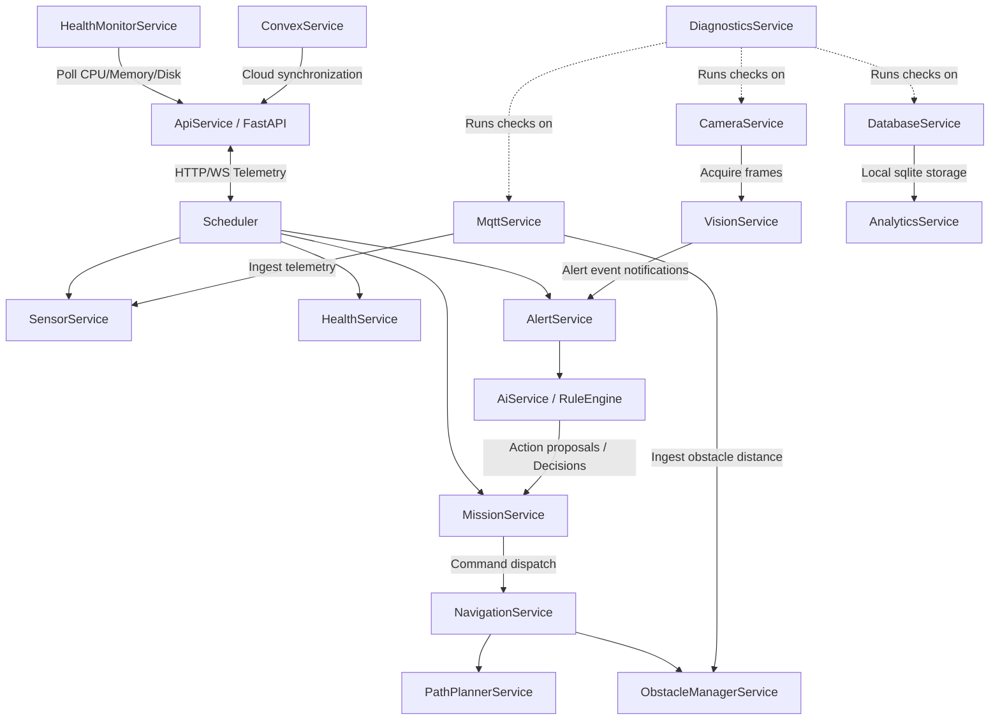

# Sentinel Twin X — System Architecture

This document describes the modular architecture of Sentinel Twin X v2, detailing how services interact across the digital twin pipeline.

## Architectural Diagram

The system employs a loosely-coupled service registry to orchestrate dependencies in a clean topological structure. The core services are illustrated below:

## Service Catalog

### 1. `PathPlannerService`
Handles Dijkstra shortest-path navigation, floor adjacency graph configurations, and ETA estimations. It removes hardcoded room names and maps coordinates dynamically from configuration files.

### 2. `ObstacleManagerService`
Ingests ultrasonic distance readings from the Mosquitto broker (emitted by the HC-SR04 physical or simulated rover sensor) and maintains active blockage status maps for paths and door entries.

### 3. `NavigationService`
Runs coordinate interpolation to transition the digital twin's visual map position cleanly and handles blocking obstacles via recovery loops.

### 4. `MissionService`
Maintains the centralized mission preemption queue and coordinates the high-level Finite State Machine (FSM).

### 5. `HealthMonitorService`
Monitors system resources (CPU, memory, disk, and battery percentages) on the primary Raspberry Pi node.

### 6. `DiagnosticsService`
Manages automated component checkups and provides toggles for failure simulations (Wi-Fi drop, MQTT loss, camera hardware fault, navigation obstacle blocking).

### 7. `AnalyticsService`
Runs cron-like schedules to generate daily, weekly, monthly, and incident summaries, with PDF/CSV export support.
