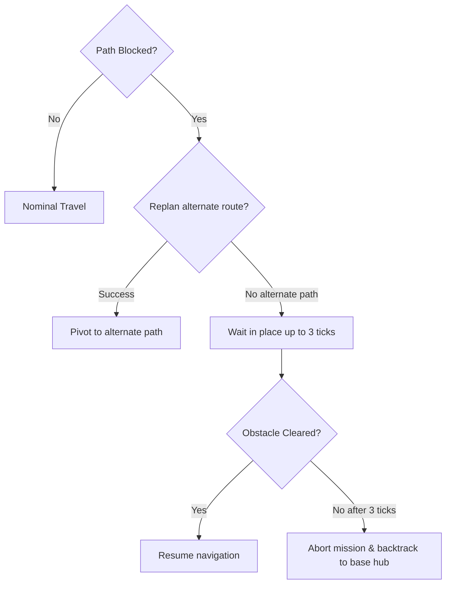

# Sentinel Twin X — Autonomous Navigation & Obstacle Recovery

This document describes shortest-path navigation, map configurations, and obstacle avoidance loops.

## Config-Driven Graph Layouts

Map paths, positions, room coordinates, and home bases are loaded from the building configuration:
```json
  "navigation_config": {
    "base_zone": "corridor",
    "travel_speed": 45.0,
    "obstacle_threshold_cm": 30.0,
    "recovery_max_retries": 3
  }
```

*   **Multi-floor Support:** Connections that cross floors (e.g. elevator nodes) are given fixed penalties in path calculations, allowing Dijkstra to plan paths across multiple floors naturally.

## Obstacle Recovery Loop

When the HC-SR04 ultrasonic distance sensor registers a reading below `obstacle_threshold_cm`:


*   **Waiting Ticks:** The rover pauses in place for up to 3 ticks (6 seconds) to allow transient obstacles to clear (e.g. a passing human).
*   **Backtracking:** If the blockage remains, the active mission is aborted, and the rover maps a recovery path back to the charging hub.
